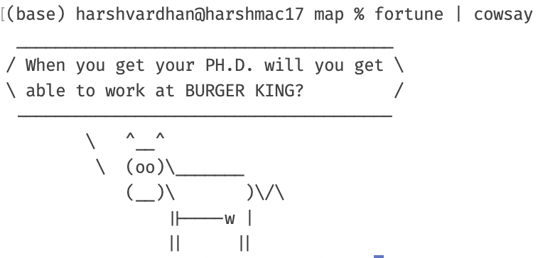
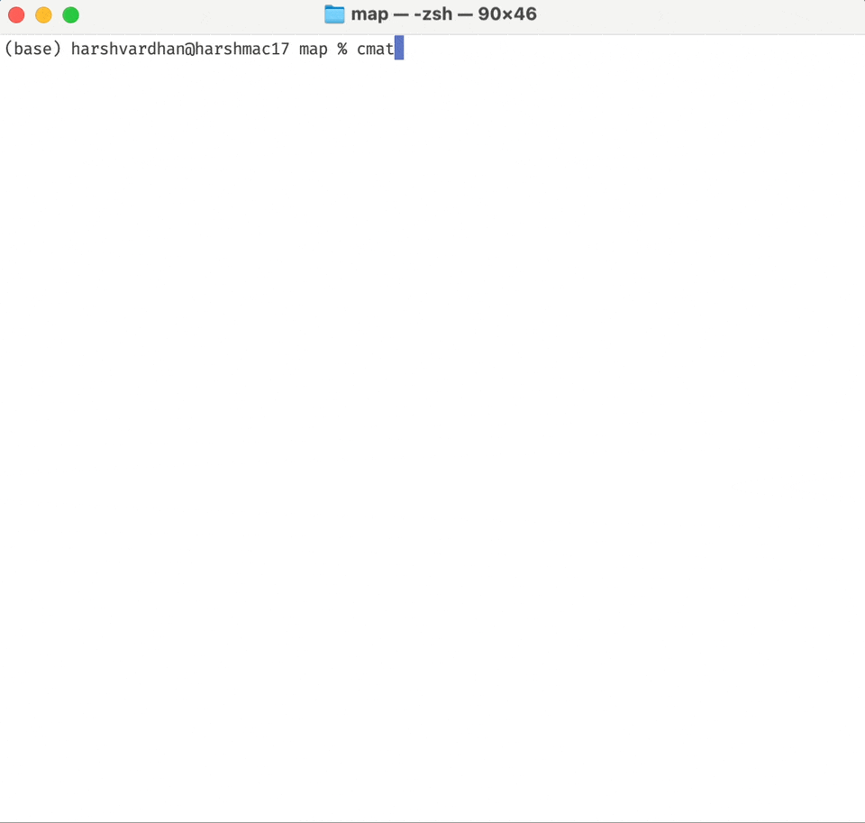
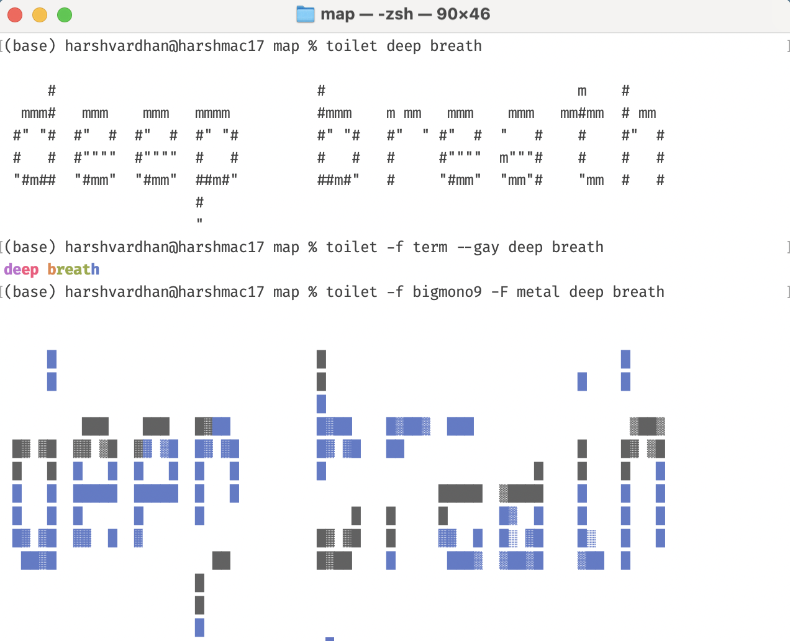
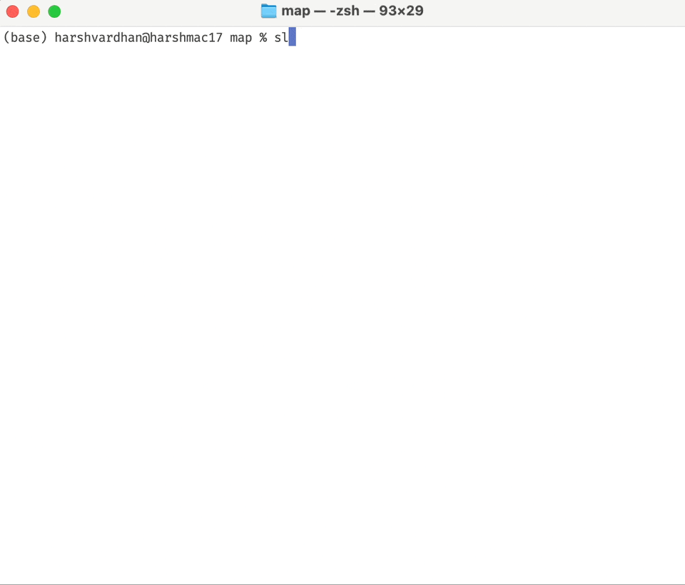
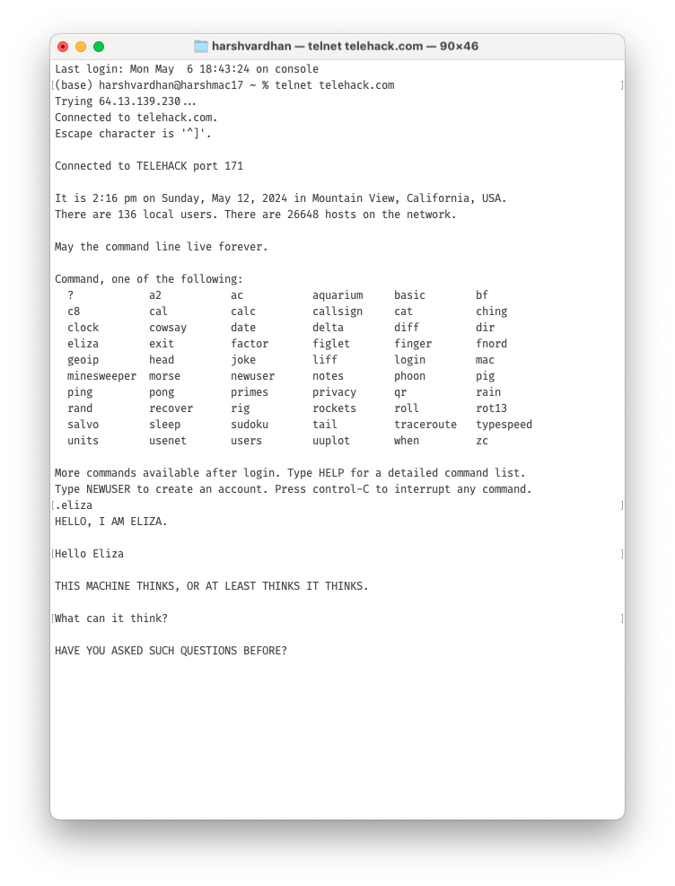
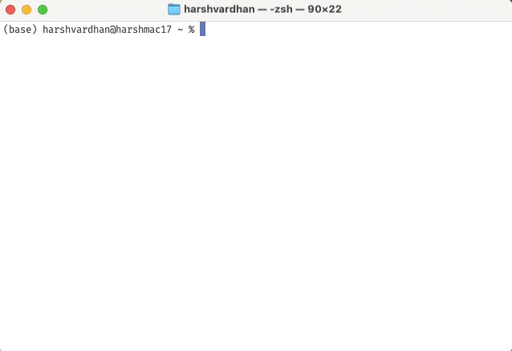

Terminal can be quite fun to play around with. On encouragement of my friend [Pablo](https://pablorious.github.io/), I ventured around to discover some interesting ones.

To use any of them, you should fire up Terminal on your MacOS/Linux/Unix and install the right packages using `apt-get` on Linux or `brew` on MacOS.

First, install [Homebrew](https://brew.sh/) if you don't have it already.

```         
/bin/bash -c "$(curl -fsSL https://raw.githubusercontent.com/Homebrew/install/HEAD/install.sh)"
```

Once you have that, install any given package using `brew install` command like below.

```         
brew install cowsay
```

## Cowsay and Fortune

`cowsay` makes a cow say whatever you want it to say. It is particularly fun to join it with `fortune` which will give you a random message.



## Code from "The Matrix"

You can see the code like in the Matrix movies with the command `cmatrix`. Install the package with `brew install cmatrix`.



## Text in Colour

Using `toilet` you can display text in a variety of colours and font styles. You can find the full list of options [here](https://delightlylinux.wordpress.com/2015/11/13/colored-text-with-toilet/).



## Train in Terminal

You can watch a choo-choo train in Terminal with the command `sl`.



## Telehack: A Collection of Terminal Apps

You can watch Star Wars and do some pretty interesting "time pass" things on Terminal. [telehack.com](https://telehack.com/) is an online website that you can also call via your terminal as:

```         
telnet telehack.com
```



Full documentation of Telehack is available at <https://telehack.com/telehack.html>. Let me give you an overview of some of my favourite commands.

1.  **aquarium:** An ASCII art animation of an aquarium/sea.
2.  **2048:** A sliding tile puzzle game.
3.  **ching:** Consult "The Book of Changes" (I Ching).
4.  **eliza:** Converse with an AI psychotherapist.
5.  **joke \[search\]:** Show a random joke from the joke database.
6.  **morse** <message>: Encode or decode Morse code.
7.  **qr** <text>: Generate a QR code.
8.  **rain:** Animated raindrops display in ASCII.
9.  **phoon:** Show the phase of the moon right now.
10. **roll:** Roll animated dice.
11. **typespeed:** A fun game to test your typing speed.

The best one in my opinion is watching Star Wars in your Terminal. I don't have the patience to finish it but its amazing to know someone put the effort to make it work.


