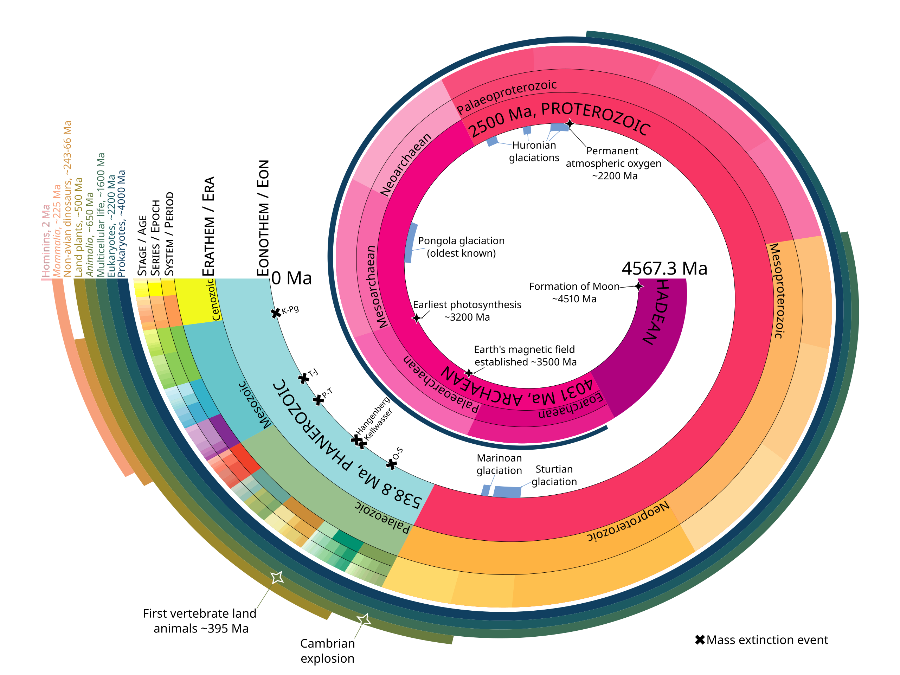
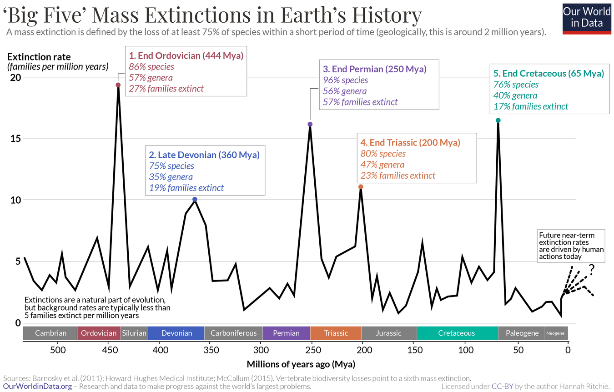
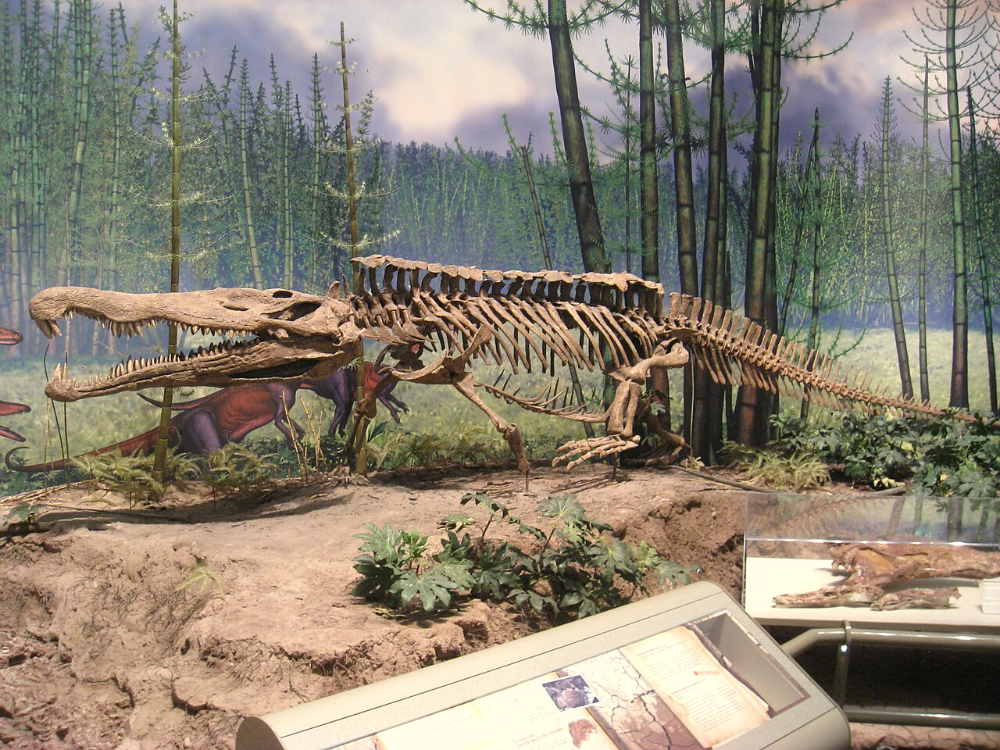
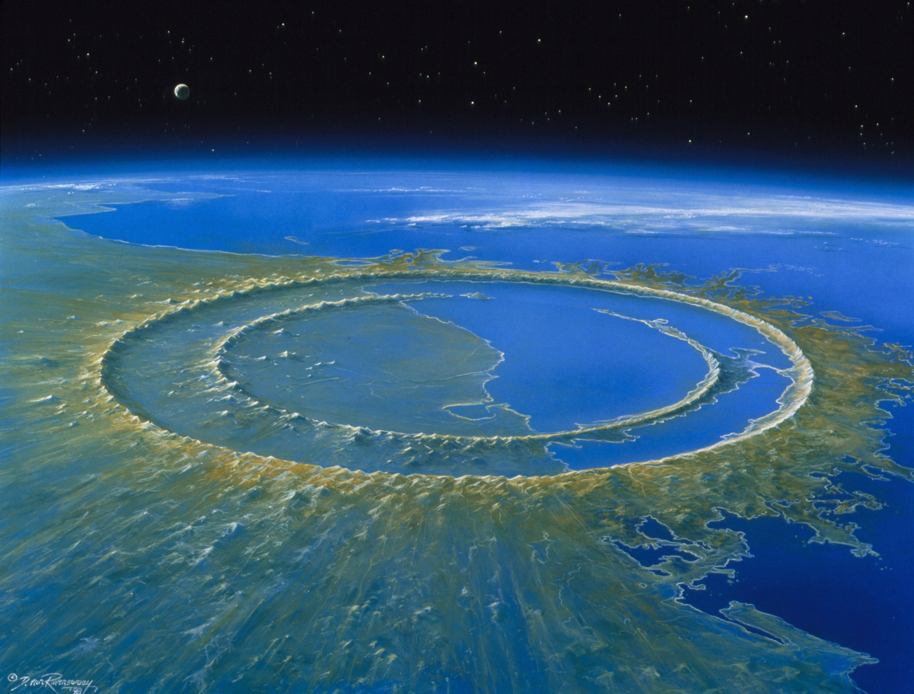
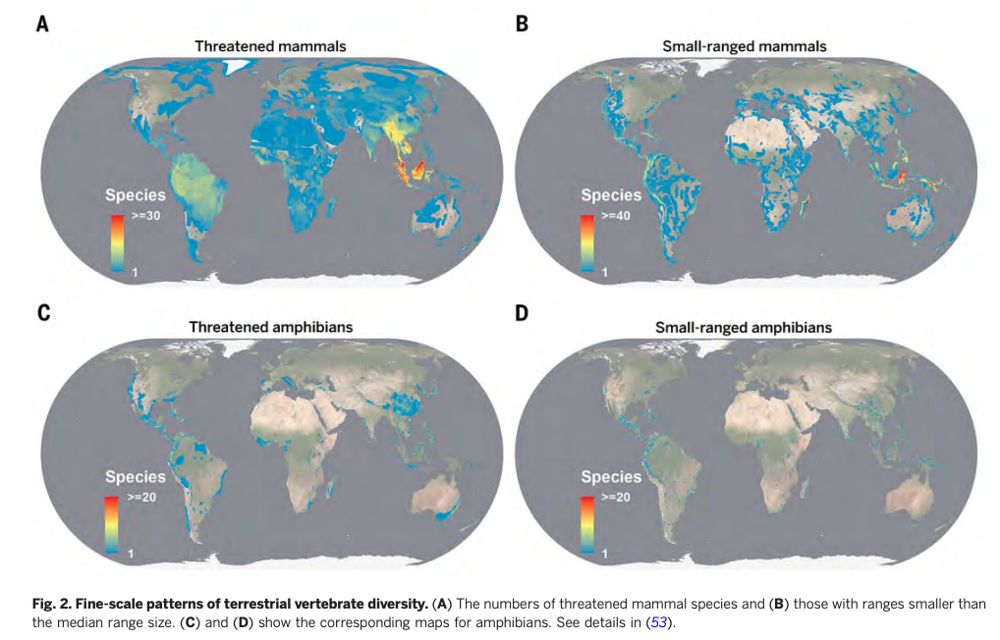

Estimating the total number of species that have ever existed on Earth is highly challenging due to the vast diversity and complexity of life.
Current estimates of the number of living species vary widely, from around 3 million to over 100 million.
One of the more [widely cited figures](https://ourworldindata.org/how-many-species-are-there) is approximately 8.7 million species currently on Earth, which includes 6.5 million on land and 2.2 million in the ocean.

But knowing the exact number is [really hard](https://ourworldindata.org/how-many-species-are-there).
As Robert May summarised in a paper published in *Science*:[^1]

[^1]: May, R. M.
    (2010).
    [Tropical arthropod species, more or less?](https://science.sciencemag.org/content/329/5987/41.summary).
    *Science*, *329* (5987), 41-42.

> If some alien version of the Starship Enterprise visited Earth, what might be the visitors' first question?
> I think it would be: "How many distinct life forms---species---does your planet have?" Embarrassingly, our best-guess answer would be in the range of 5 to 10 million eukaryotes (never mind the viruses and bacteria), but we could defend numbers exceeding 100 million, or as low as 3 million.

But most --- 99.9% --- of all species to ever exist aren't alive today, i.e. are **extinct**.
The largest extinction event, known as the **Great Dying**[^2], took place around 250 million years ago and wiped out 96% of species.
Another extinction that occurred 65 million years ago eliminated about 76% of all plants and animals.

[^2]: NASA has a [great explainer](https://science.nasa.gov/science-research/earth-science/the-great-dying/) on the Great Dying.
    The causes aren't clear to us.
    Scientists have suggested many possible causes for the Great Dying: severe volcanism, a nearby supernova, environmental changes wrought by the formation of a super-continent, the devastating impact of a large asteroid --- or some combination of these (my guess too).
    We are able to learn more about this thanks to cosmic gas trapped.

Every now and then, I remind people that we are all transient; that's the nature of reality.
Our current power as humans is due to sheer luck, and it won't last forever.
Indeed, we humans only evolved as *Homo sapiens* 200,000 years ago, with our earliest chimpanzee ancestors around 2 million years ago.
(Cockroaches[^3] and mosquitoes[^4] have been alive for at least 300-325 and 217 million years, respectively.
)

[^3]: Cockroaches date back to the Carboniferous period, approximately 300-325 million years ago.
    This period is marked by the oldest putative fossil evidence of stem-dictyoptera, which includes cockroaches ([Legendre et al., 2015](https://www.semanticscholar.org/paper/Phylogeny-of-Dictyoptera%3A-Dating-the-Origin-of-and-Legendre-Nel/c4178c6215be3285779defa8bfc7d43217a17450)).

[^4]: Mosquitoes are an ancient group -- around 217 million years old -- that probably originated in South America before it was South America, on one big land mass called Gondwana that hadn't yet split apart.
    [Source](https://news.ncsu.edu/2023/10/mosquito-family-tree/).

Nature has repeatedly wiped out species from the face of the earth---five times already, not including the ongoing sixth extinction.
Let's look at these in some detail.

## Big Five Extinction Events

Even though species extinction has been a continuous event through the history, the five outliers have stuck out as a sore thumb.

In a [landmark paper](https://www.science.org/doi/10.1126/science.215.4539.1501) published in 1982, Jack Sepkoski and David M. Raup identified five significant geological intervals characterized by excessive diversity loss.
Initially, these intervals were seen as outliers in a general trend of decreasing extinction rates during the Phanerozoic Eon.
(The Phanerozoic is the current and most recent of the four main divisions of Earth's history, spanning from 538.8 million years ago to today.)

However, as more rigorous statistical tests have been applied to accumulating data, it has become clear that multicellular animal life in the Phanerozoic Eon has experienced at least five major and many minor mass extinctions.

Consider this spiral timeline of our history: starting from the formation of moon 4510 million years ago to the birth of Hominins (group of species that includes modern humans (*Homo sapiens*) and our closest relatives after our lineage split from the chimpanzees).[^5]

[^5]: This group includes all species on our branch of the evolutionary tree after this split, encompassing extinct species such as Homo neanderthalensis (Neanderthals), Homo erectus, and Australopithecus species.
    Hominins are characterized by traits such as bipedalism (walking on two legs), larger brain sizes relative to body size, and more complex tool use compared to other primates.



> The geologic time scale, proportionally represented as a log-spiral with some major events in Earth's history.
> A [megaannus](https://en.wikipedia.org/wiki/Megaannus) (Ma) represents one million (106) years.
> Big five mass extinctions are denoted as X.
>
> By Jarred C Lloyd - Own work, CC BY 4.0, <https://commons.wikimedia.org/w/index.php?curid=147428651>

During this time, a wide variety of animal and plant life has thrived, spread, and adapted to different environments.
This eon began with the **Cambrian period**, when animals first developed hard shells (or bones) that are well-preserved in fossils.

Let's see the timeline of the "Big Five" Mass Extinctions in more detail.



> "There have been five mass extinctions in Earth's history" by Hannah Richtie (2022).
> *Our World in Data.* Source: <https://ourworldindata.org/mass-extinctions>

What were the cause, impact, timeline and species that went extinct for each of them?

## 1. Ordovician-Silurian Extinction (approx. 443 million years ago)

A significant glaciation event, known as the [Hirnantian glaciation](https://en.wikipedia.org/wiki/Hirnantian), occurred towards the end of the Ordovician period.
This glaciation caused a dramatic drop in global temperatures and a corresponding drop in sea levels as large amounts of water were trapped in ice sheets.
The resulting habitat loss in shallow marine environments led to widespread species extinctions.

This cooling also resulted in widespread oceanic and atmospheric circulation patterns.
Reduced oxygen levels in the oceans, a condition known as **anoxia**, may also have occurred due to changes in ocean circulation and productivity.
Anoxic conditions can be deadly for many marine organisms, particularly those in deeper waters.

Here's another wild [hypothesis](https://www.nature.com/articles/news030922-7).
Many scientists say that the initial extinctions might have been sparked by a gamma-ray burst from a hypernova in a nearby arm of the Milky Way, just 6,000 light-years away.
A ten-second burst destroyed half of Earth's ozone layer[^6], leaving surface-dwelling organisms, including the ones keeping our planet green with photosynthesis, exposed to intense ultraviolet radiation.

[^6]: Ozone (O3) + Gamma Ray = Oxygen (O2) + Oxygen Free Radical (O+)

-   **Causes**: Severe ice age, falling sea levels, possible gamma-ray burst; followed by glaciers melting and rapid warming phase.
-   **Impact**: About 85% of marine species went extinct.
-   **Examples of Extinct Species**: Many brachiopods, bryozoans, and trilobites.
-   **Timeline**: Occurred over a period of about 1 million years.

## 2. Late Devonian Extinction (approx. 375-359 million years ago)

By the Late Devonian, the land had been colonized by plants and insects.
In the oceans, massive reefs were built by corals.
The continents were arranged quite differently than they are today.
Gondwana, a supercontinent, dominated the Southern Hemisphere.
In the Northern Hemisphere, the continent of Siberia held its position, while Laurussia---formed from the collision of Baltica and Laurentia---drifted towards Gondwana, gradually closing the Rheic Ocean.
The Caledonian mountains were rising in what is now the Scottish Highlands and Scandinavia, while the Appalachians were forming in America.

This was the period that killed most of the coral reefs, which later evolved again a few hundred million years later.
This mass extinction was a two-pulsed event: the two extinction pulses being separated by an interval of approximately 800,000 years.
The second pulse was more severe than the first.

-   **Causes**: Possible asteroid impacts, climate change, widespread ocean anoxia.
-   **Impact**: Around 75% of species, particularly affecting marine life.
-   **Examples of Extinct Species**: Numerous fish species and coral reefs.
-   **Timeline**: Spanned several million years, with multiple extinction pulses.

## 3. Permian-Triassic Extinction (approx. 252 million years ago)

The most severe of the mass extinctions gave this period the name: **The Great Dying**.
During this phase, Earth's average temperature increased by 8 °C (14 °F) and and an increase in CO2 levels to 2,500 ppm (for comparison, the concentration immediately before the Industrial Revolution was 280 ppm and now its about 415 ppm).
It is also associated with sharp increase in the abundance of marine and terrestrial fungi, caused by the sharp increase in the amount of dead plants and animals fed upon by the fungi.

This extinction period is also marked by the absence of coal --- all coal-forming plants were likely killed and it tool another ten million years for a new suite of plants to form peat.
The most significant cause is volcanic eruptions in Siberian Traps, which lead to one of the most rapid rises of atmospheric carbon dioxide levels in the geologic record.
This lead to global warming: surface land temperature increased by 17 °C, surface water temperature increased by 8 °C, and air temperature increased by around 12 °C.
They were also trapping halogens, extremely destructive to ozone; 70% of trapped halogens was released in atmosphere.

-   **Causes**: Volcanic activity in the Siberian Traps, climate change, ocean acidification, anoxia.
-   **Impact**: Largest extinction event, with about 96% of marine species and 70% of terrestrial vertebrates going extinct.
-   **Examples of Extinct Species**: Trilobites, large amphibians, many types of reef-building organisms.
-   **Timeline**: Occurred over a period of about 60,000 years to a few hundred thousand years.

## 4. Triassic-Jurassic Extinction (approx. 201 million years ago)

Towards the end of the Triassic period, the fourth mass extinction took place marking the boundary between the Triassic and Jurassic periods.
The primary cause was massive volcanic activity associated with the Central Atlantic Magmatic Province ([CAMP](https://en.wikipedia.org/wiki/Central_Atlantic_magmatic_province)).
Again, these events led to increase in atmospheric CO2, [acidification](https://en.wikipedia.org/wiki/Ocean_acidification) of ocean, anoxia and changes in water currents.
CAMP also increased the amount of toxic mercury, killing many by mercury poisoning.

This extinction also cleared a lot of land space, paving the way for dinosaurs to be the apex predators of the planet.
Some species of dinosaurs went extinct, but most lived on to be at the top of the food chain.

This extinction event is also quite similar in nature to Anthropocene extinction.
If human-induced climate changes --- increased carbon dioxide levels, ocean acidification, and ocean deoxygenation --- persists as is, predictions can be made as to how various aspects of the biosphere will respond based on these records.



-   **Causes**: Likely volcanic activity, climate change, and rising sea levels.
-   **Impact**: Around 80% of species went extinct.
-   **Examples of Extinct Species**: Many marine reptiles, large amphibians, certain genera of early dinosaurs.
-   **Timeline**: Occurred over a period of less than 10,000 to several tens of thousands of years.

## 5. Cretaceous-Paleogene Extinction (approx. 66 million years ago)

The fifth mass extinction was triggered by a massive asteroid impact in Yucatán Peninsula, present day southeast Mexico, creating [Chicxulub crater](https://www.google.com/search?q=chicxulub+crate), named after the Mexican town where it was found (pictured below).
This impact released enormous amounts of energy, causing fires, tsunamis, and a "nuclear winter" effect, where debris blocked sunlight, halting photosynthesis and drastically altering the climate.
Oceans became significantly acidic which, obviously, affected marine life.
Around the same time, volcanic eruptions in Deccan region of present day India also led to significant changes in global climate.



This mass extinction resulted in annihilation of approximately 75% of world's known species, including most dinosaurs, marine reptiles, and more.
The extinction severely affected marine species, particularly those dependent on phytoplankton.
Only about [13% of species](https://www.worldatlas.com/articles/the-cretaceous-paleogene-extinction-event.html) that relied on marine phytoplankton survived.
On land, the extinction was catastrophic for large vertebrates, including all non-avian dinosaurs.
Birds, the only dinosaur lineage to survive, and mammals began to diversify and evolve rapidly in the aftermath.

However, the extinction event also opened up evolutionary opportunities, leading to significant [adaptive radiation](https://en.wikipedia.org/wiki/Adaptive_radiation).
In its aftermath, many groups rapidly diverged into new forms and species to fill the newly available ecological niches.
Mammals, in particular, underwent extensive diversification, evolving into various forms including horses, whales, bats, and primates.
The surviving dinosaurs were primarily those capable of flight, which evolved into the modern species of birds.

-   **Causes**: Asteroid impact (Chicxulub crater), volcanic activity in the Deccan Traps, climate change.
-   **Impact**: About 75% of species, including all non-avian dinosaurs, went extinct.
-   **Examples of Extinct Species**: Tyrannosaurus rex, Triceratops, various marine reptiles.
-   **Timeline**: Occurred rapidly, possibly within a few years to a few decades.

## 6. Holocene/Anthropocene Extinction (current)

> We are currently, in a systematic manner, exterminating all non-human living beings.
>
> --- [Anne Larigauderie](https://en.wikipedia.org/wiki/Anne_Larigauderie), IPBES, United Nations

Holocene or Anthropocene mass extinction is the ongoing mass extinction (as I write!), caused by humans alone.
Our activities have resulted in widespread degradation of biodiversity hotspots such as coral reefs and rainforests.
E.g., coral reefs cover 0.1% of ocean floor but house over 25% of all marine species.
The current rate of extinction is estimated to be 100 to 1000 times more than the natural background extinction rate.
More species are going extinct in Asia than elsewhere.[^7]

[^7]: Pimm SL, Jenkins CN, Abell R, Brooks TM, Gittleman JL, Joppa LN, Raven PH, Roberts CM, Sexton JO (30 May 2014).
    "[The biodiversity of species and their rates of extinction, distribution, and protection](https://static.squarespace.com/static/51b078a6e4b0e8d244dd9620/t/538797c3e4b07a163543ea0f/1401395139381/Pimm+et+al.+2014.pdf)"



This likely started with megafauna (large mammals) extinction around 50,000 years ago, which continued till around 12,000 years ago when wolly mammoth became extinct.
Human hunting and competition from other mammals were a large reason for their degrowth.

Like all facts that haven't become history yet, this ongoing extinction is still questioned by some scientists.
I don't think you need convincing that we humans have irrevocably changed the ecology of the planet, but if you still doubt it, here's a [lot more evidence](https://ourworldindata.org/climate-change).

<blockquote class="text-post-media" data-text-post-permalink="https://www.threads.net/@harsh17.in/post/C9DJ8VdOKLB" data-text-post-version="0" id="ig-tp-C9DJ8VdOKLB" style=" background:#FFF; border-width: 1px; border-style: solid; border-color: #00000026; border-radius: 16px; max-width:540px; margin: 1px; min-width:270px; padding:0; width:99.375%; width:-webkit-calc(100% - 2px); width:calc(100% - 2px);">

<a href="https://www.threads.net/@harsh17.in/post/C9DJ8VdOKLB" style=" background:#FFFFFF; line-height:0; padding:0 0; text-align:center; text-decoration:none; width:100%; font-family: -apple-system, BlinkMacSystemFont, sans-serif;" target="_blank">

::: {style=" padding: 40px; display: flex; flex-direction: column; align-items: center;"} ::: {style=" display:block; height:32px; width:32px; padding-bottom:20px;"} <svg aria-label="Threads" height="32px" role="img" viewBox="0 0 192 192" width="32px" xmlns="http://www.w3.org/2000/svg"> <path d="M141.537 88.9883C140.71 88.5919 139.87 88.2104 139.019 87.8451C137.537 60.5382 122.616 44.905 97.5619 44.745C97.4484 44.7443 97.3355 44.7443 97.222 44.7443C82.2364 44.7443 69.7731 51.1409 62.102 62.7807L75.881 72.2328C81.6116 63.5383 90.6052 61.6848 97.2286 61.6848C97.3051 61.6848 97.3819 61.6848 97.4576 61.6855C105.707 61.7381 111.932 64.1366 115.961 68.814C118.893 72.2193 120.854 76.925 121.825 82.8638C114.511 81.6207 106.601 81.2385 98.145 81.7233C74.3247 83.0954 59.0111 96.9879 60.0396 116.292C60.5615 126.084 65.4397 134.508 73.775 140.011C80.8224 144.663 89.899 146.938 99.3323 146.423C111.79 145.74 121.563 140.987 128.381 132.296C133.559 125.696 136.834 117.143 138.28 106.366C144.217 109.949 148.617 114.664 151.047 120.332C155.179 129.967 155.42 145.8 142.501 158.708C131.182 170.016 117.576 174.908 97.0135 175.059C74.2042 174.89 56.9538 167.575 45.7381 153.317C35.2355 139.966 29.8077 120.682 29.6052 96C29.8077 71.3178 35.2355 52.0336 45.7381 38.6827C56.9538 24.4249 74.2039 17.11 97.0132 16.9405C119.988 17.1113 137.539 24.4614 149.184 38.788C154.894 45.8136 159.199 54.6488 162.037 64.9503L178.184 60.6422C174.744 47.9622 169.331 37.0357 161.965 27.974C147.036 9.60668 125.202 0.195148 97.0695 0H96.9569C68.8816 0.19447 47.2921 9.6418 32.7883 28.0793C19.8819 44.4864 13.2244 67.3157 13.0007 95.9325L13 96L13.0007 96.0675C13.2244 124.684 19.8819 147.514 32.7883 163.921C47.2921 182.358 68.8816 191.806 96.9569 192H97.0695C122.03 191.827 139.624 185.292 154.118 170.811C173.081 151.866 172.51 128.119 166.26 113.541C161.776 103.087 153.227 94.5962 141.537 88.9883ZM98.4405 129.507C88.0005 130.095 77.1544 125.409 76.6196 115.372C76.2232 107.93 81.9158 99.626 99.0812 98.6368C101.047 98.5234 102.976 98.468 104.871 98.468C111.106 98.468 116.939 99.0737 122.242 100.233C120.264 124.935 108.662 128.946 98.4405 129.507Z" /></svg> :::

::: {style=" font-size: 15px; line-height: 21px; color: #999999; font-weight: 400; padding-bottom: 4px; "} Post by @harsh17.in :::

::: {style=" font-size: 15px; line-height: 21px; color: #000000; font-weight: 600; "} View on Threads ::: :::

</a>

</blockquote>

```{=html}
<script async src="https://www.threads.net/embed.js"></script>
```
-   **Causes**: Human activities (habitat destruction, pollution, overhunting, climate change, invasive species).
-   **Impact**: Estimated that species are going extinct at 100 to 1,000 times the natural background rate, with significant declines in biodiversity. The International Union for Conservation of Nature (IUCN) reports that over 26,000 species are threatened with extinction.
-   **Examples of Extinct Species**: Passenger pigeon, Western black rhinoceros, various amphibians.
-   **Timeline**: Ongoing, with accelerated rates of extinction over the past few centuries. The current rate suggests that around 1 million species could face extinction in the coming decades.

## Concluding Thoughts

You may notice that each extinction is happening more quickly than before: first and second took over a million years, third one 60,000 years, fourth one 10,000 years, fifth one only a few decades.
Will the sixth (ongoing) will kill \>80% species in just a few years?

The other interesting thing is that nature has routinely killed over 70% species in every mass extinction.
Indeed, over 99% of all species (not organisms but individual species) have gone extinct over the course of Earth's history.
But we (still) have so much diversity in life today.
What would the world be like in a few million years?

It has been well said that forests precede mankind; deserts follow.
We love to say "save the planet" but actually, we are striving to "save ourselves".
In the words of Lester Brown, "We have not inherited this earth from our forefathers; we have borrowed it from out children".[^8]

[^8]: My first introduction to persuasive arguments, not scientific but gut wrenching and convincing, on climate change was Nani Palkhivala's "[The Ailing Planet: The Green Movement's Role](https://ncert.nic.in/textbook/pdf/kehb104.pdf)".
    It was part of my NCERT textbook in Class 11, though originally published in *The Indian Express*.


<iframe style="border:none;" width="100%" height="590" src="https://www.are.na/harsh/anti-capitalism-and-pro-degrowth/embed" title="Harsh&#39;s Are.na Channel on Economics et al.">

</iframe>
