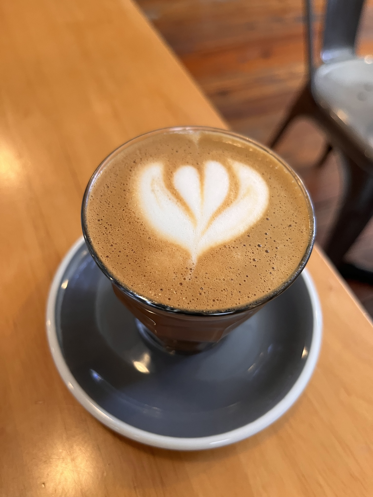

I've been in Knoxville for more than three years now since I started my PhD in Analytics at the Haslam College of Business, University of Tennessee.
During this time, I have explored a fair bit of cafes around.
Not all cafes, but most cafes within 5 mile radius of the university.
That covers almost every cafe in downtown Knoxville, the university area, and South Knoxville.

I’ve had many friends and colleagues ask me about my favorite spots for coffee, so I thought it would be helpful to share my experiences.
Note that I haven't been to enough cafes in West or North Knoxville, so they aren't part of this list.

Initially, I thought I will rate them out of five.
But that's really hard.
How do I differentiate between three 4/5 cafes?

I'm reading [The Anthropocene Reviewed](https://www.goodreads.com/book/show/55145261-the-anthropocene-reviewed) by John Green where talks about the fundamental flaw of five-star scale.
He aptly says:

> The five-star scale doesn't really exist for humans; it exists for data aggregation systems, which is why it didn't become standard until the internet era.

Since this post isn't a replacement of Google Maps (or our own [Map of Tiny Perfect Things](https://perfectplaces.cool/)), I am only going to provide you with a few lines about my favourite cafes around the area.

Another note: I usually get a Cortado or a Latte from these cafes.[^1]
The reviews will reflect that.
(Pro-tip: Several places can/will provide you seltzer water along with your Cortado. Using carbonated water as pallet cleanser will let you taste every sip of your coffee as the first sip. Just ask your barista if they can!)

[^1]: Cortado translates to cut, meaning that the coffee is cut with milk.
    A cortado coffee is made of equal parts espresso and steamed milk.
    It is often served with a double shot espresso.

# My Fav Cafe: Old City Java

I am currently writing this from **Old City Java**, a cafe in downtown Knoxville.
Hands down, this place has the best Cortado in Knoxville.
It also has a mini-library that you can contribute to or borrow books from.

> Cortado from Old City Java, best Cortado in Knoxville.
> August 7, 2024.

# Honourable Mentions

-   **Mahalo Coffee Roasters** for modern insides and great Cortados (as good as Old City Java).
-   **Coffee Underground** for its vibe & inviting atmosphere on campus. They also organise open mic events often. Kelly, the owner, can often be spotted working there --- which is a rarity for most businesses. They have freshly roasted coffee beans too. (I was their first customer to buy beans. Beans: 10/10.)
-   **Honeybee** is great for their croissants and bakery items. But make sure you reach before 12 noon, as they run out pretty quick.
-   **Seed Coffee Co.** & **Remedy Coffee** are great for spaces with larger groups and comfortable all day sitting. I also got reading/writing done many days sitting here.
-   **Golden Roast** & **Capybara** have best coffee around the university campus.
-   **Coffee & Chocolate** is for "okay" coffee but good desserts (macaroons, artisanal chocolates). It is also the only place open till 10 pm that serves actual coffee.[^2]
-   **Frothy Monkey** has good coffee that also serves food. Also open till 9 pm. I've done omelettes and coffee dinners here several times.
-   **Jack's Coffee and Plants** has backdoor/balcony sitting amongst trees. They also allow pets.
-   **Awaken Coffee** is a cafe that's open till 7 pm. Good coffee as well. I've written parts of my dissertation here, so this place is special.
-   **Fine & Hoek** is originally a coffee roaster, so this is where you can buy your beans from.

[^2]: Pablo, if you're reading this: No, Urban Bar and Corner Cafe doesn't count.

---

This post is NOT sponsored by anyone.

  <iframe src="https://www.are.na/harsh/coffee-v_mz29lonrc" width="100%" height="800" style="border:none;"></iframe>

