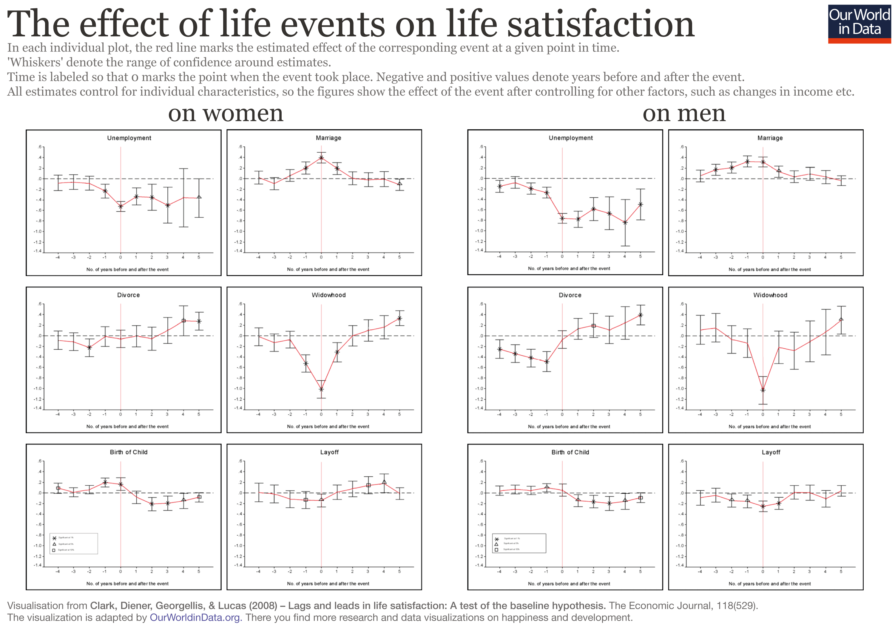
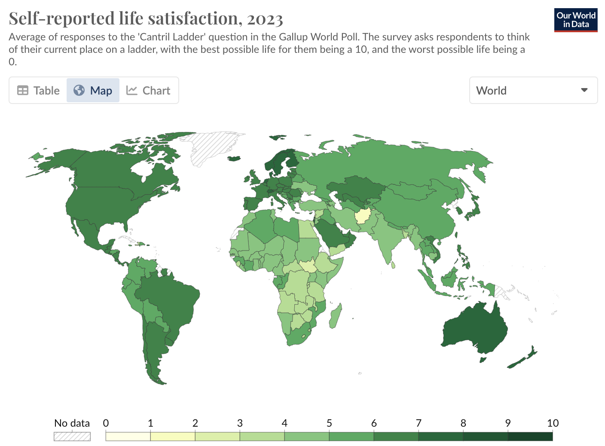
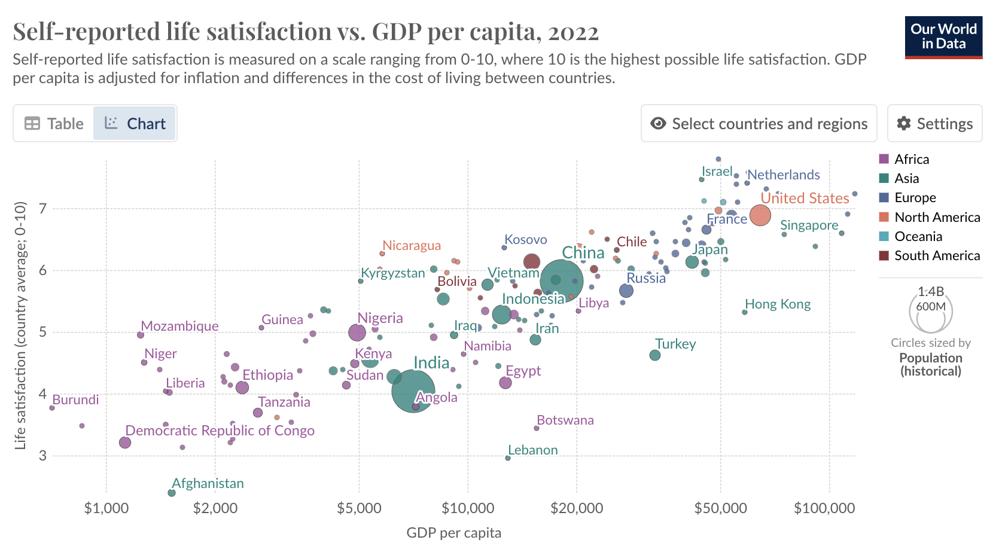
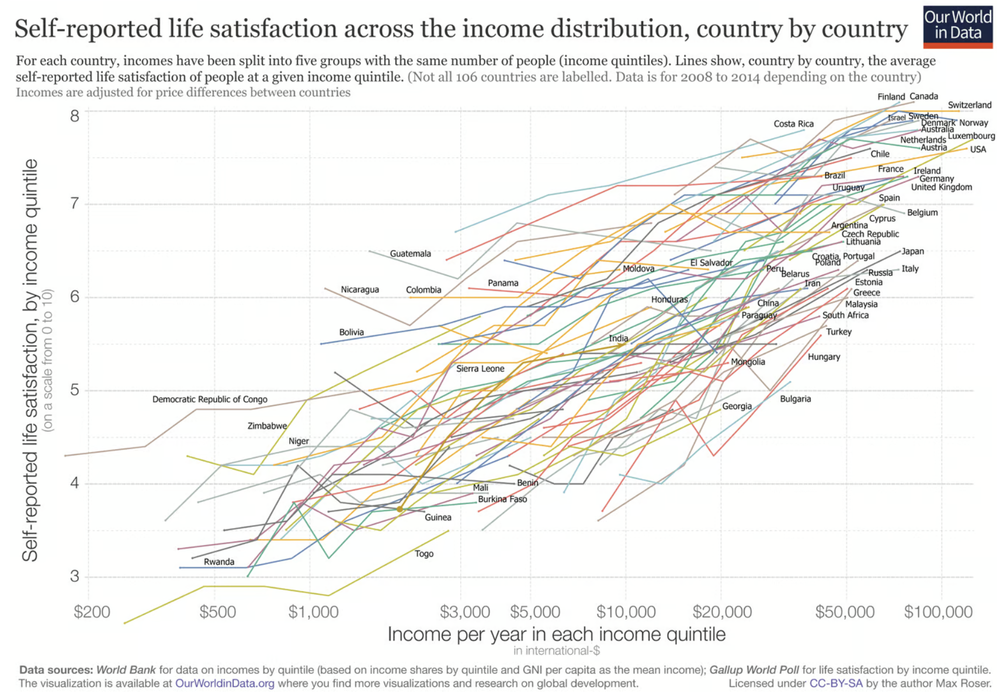
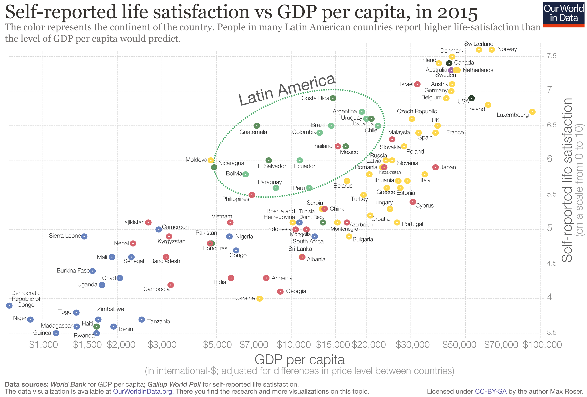

## Try the quiz

If you want to test your knowledge about happiness around the world, try this quiz I made based on [World Happiness Report 2024](https://worldhappiness.report/).

Quiz: <https://fascinating-centaur-2c7996.netlify.app/>

---

One of the early realizations of my life was that happiness depends more on perspectives than circumstances.
A wise person would strive for a perspective that brings them happiness.
So, why isn't everyone happy?
To a large extent, it's because we are told what should make us happy: job, marriage, kids, and so on.

But happiness isn't just a momentary thing!
Like bad experiences, sensations that bring happiness eventually change.
Even if you get a nice job, a better one might make you slightly happier, but only for a short while.

Long-term studies have shown that lottery winners and individuals who lost a limb eventually revert to their previous "normal" levels of happiness.[^1]
Even other life events like marriages and child birth hardly affect happiness in the long term.

[^1]: Brickman, P., Coates, D., & Janoff-Bulman, R.
    (1978).
    [Lottery winners and accident victims: Is happiness relative?](https://www.romolocapuano.com/wp-content/uploads/2020/12/Brickman_LotteryWinners.pdf).
    *Journal of personality and social psychology*, *36*(8), 917.

## Money and Status

Sociocultural factors like status and role in society do have an impact on happiness.
Some claim money brings happiness, and that's true---but only to a certain extent.
Someone earning \$150,000 isn't necessarily happier than someone earning \$100,000.[^2]

[^2]: The actual number seems to be somewhere between \$75,000 to \$100,000 beyond which money becomes less important in happiness. See [Does Money Buy Happiness? Here’s What the Research Says](https://knowledge.wharton.upenn.edu/article/does-money-buy-happiness-heres-what-the-research-says/).

However, biologists insist that if happiness is measured as pleasure, it is determined by the chemical composition of balance of three biochemicals: oxytocin, dopamine, and serotonin.

If that's the case, should people be drugged with the right amounts of these hormones?
Thankfully, we're saner than that---for the most part.
Yet, this doesn't stop us from doing things like putting VR headsets on cows to show them green pastures in farms.
How cruel are we?[^3]
Even if humanity achieves utopia, would it be utopia for the world?
Most likely not.

[^3]: [Russian cows get VR headsets 'to reduce anxiety'](https://www.bbc.com/news/world-europe-50571010), BBC, November 27, 2019.

Still, all this discussion revolves around pleasure.
Happiness itself remains a mystery biologically.
Someone with cancer could feel happy, while a perfectly healthy person might not.

## How do we measure happiness?

### Cantril Ladder

The World Happiness Report ranks countries using the "Cantril Ladder," developed by Harvard psychologist Dr. Cantril.
Participants imagine a ladder with steps from 0 (worst life) to 10 (best life) and rate where they stand.
In 2024, countries highest on the Cantril Ladder included Finland, Denmark, Iceland, Israel, and the Netherlands, while countries at the bottom included Afghanistan, Lebanon, and Sierra Leone.
Below is the whole world on 'Cantril Ladder'.

This measure of happiness correlates heavily with economic well being (as measured by GDP per capita).
There is almost perfectly linear trending line.

Even within the countries, higher income results in higher score in Cantril's ladder --- all trending upwards --- as income increases, self-reported life satisfaction measured through Cantril's ladder go up.

But is comparing yourself from your "best possible self" and your "worst possible self" is really the best measure of happiness?

### Positive Affect

Another measure from the Gallup Poll asks, "Did you experience happiness yesterday?" (**Positive Affect**).
It combines the answers to three Yes/No questions:

1.  Did you experience enjoyment during a lot of the day yesterday?
2.  Did you learn or do something interesting yesterday?
3.  Did you smile or laugh a lot yesterday?

Here, Latin American countries like Paraguay, Panama, and Guatemala rank highest.
Interestingly, different measures yield different results---Nordic countries often rank high for life satisfaction, while Latin American nations excel in daily happiness.
At the bottom of these scales, Afghanistan has been the lowest globally since 2017.

Even when happiness is measured through "Cantril's Ladder", Latin America countries are outliers.

But I don't think any of the two questions measure happiness.
Of course, these are two good questions but neither is perfect, because there is no perfect scale for measuring everyone's happiness.

------------------------------------------------------------------------

We've established that representing happiness, both biologically and in survey design, remains elusive.

Therefore, I hypothesize: perspectives that make us happy require objective, unbiased, patient, and persistent observation.
A story from Buddha's life illustrates this: On a cold winter night, Siddhartha Gautama, dressed in rags, was asked how he seemed so cheerful despite the harsh weather.
Buddha replied that suffering does not come from the cold or the wind but from the mind.
True contentment, he said, doesn't depend on circumstances but on understanding the nature of the mind.

Essentially, happiness is a mental game.
Humans often misplace their pursuit of happiness by chasing fleeting external stimuli---wealth, power, relationships---believing they bring lasting joy.
Buddha's teachings take a radically different view.
The core idea of *anicca* (impermanence) is that everything in life---emotions, sensations, possessions, and even our identities---is transient.
Suffering arises when we cling to these impermanent things.
[Vipassana](https://blog.harsh17.in/vipassana2/) (a special way to "see") was Buddha's method of teaching people to directly observe their sensations and see reality as it is.

Buddha also taught *anapana* (observation of respiration) as a "deliciously pleasant way of living." So, what is happiness, if you ask me?
It is the absence of suffering.
If you're not happy, you're likely experiencing suffering.
And what is peace?
Happiness at rest.
Happiness is closer to joy than pleasure.

Death, the fact that our entire life is impermanent, adds reasoning to happiness.
Indeed, as [Meenal](https://meenalsingh.substack.com/p/what-is-being-alive) says:

> What does death teach us about being alive?
> That it is not permanent, and probably a punishment if it becomes permanent.
> The most comfortable life imaginable will become a prison for you once you have to live it forever.
> There are no ups without downs.
> It just becomes a plain never-ending vast surface.

Anyway, thanks for coming to my TED Talk.
Maybe you'll decide to find what makes *you* happy---or maybe not, but please do.
Because more likely than not, it is different from everyone else in the world.
In any case, I hope we've learned a thing or two about happiness.

## Some Fun Facts from World Happiness Survey

1.  Younger generation (millennial and Gen Z) is more likely than their predecessors to help others in need, especially post-COVID.
2.  Financial well-being (GDP per capita), Social support, Healthy life-expectancy, Freedom to make life-choices, generosity, and perception of corruption together can explain 78% of variation in life satisfaction (Cantril ladder score, Regression's adjusted R2 = 0.78).
3.  Older age is associated with higher life satisfaction in India, refuting some claims that the positive association between age and life satisfaction only exists in high-income nations. However, older women in India report lower life satisfaction than older men.

## Additional Readings

1.  [How they find the "happiest" country on Earth, YouTube](https://www.youtube.com/watch?v=eg1--c2r8HE)
2.  [Happiness and Life Satisfaction by Our World in Data](https://ourworldindata.org/happiness-and-life-satisfaction)
3.  [World Happiness Report, 2024](https://worldhappiness.report/ed/2024/)

-- Harsh
