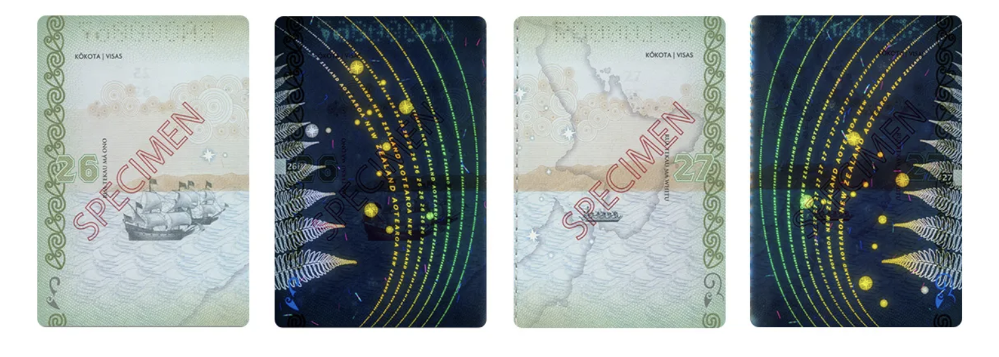

A passport is "an official travel document issued by a government that certifies a person's identity and nationality for international travel." The word comes from the medieval French *passer* ("to pass") and *port* ("harbor"): originally a document allowing you to pass through a port town’s gate.
The document requests all border protection agencies and governments to give safe passage to the bearer.
It validates the identity of the concerned citizen.
My Indian passport specifically says:

> These are to request and require in the name of the President of the Republic of India, all those whom it may concern to allow the bearer to pass freely without let or hindrance and to afford him or her every assistance and protection of which he or she may stand in need.
>
> — By The Order of President of Republic of India

Today, passports are one of the most acceptable form of identification worldwide, thanks to **International Civil Aviation Organization (ICAO)**, a United Nations agency, which sets global standards for travel documents.
It dictates the qualities of passport like machine-readable zones which enable automated immigration system updates, and biometric e-passports which contain a chip with facial and fingerprint information.[^1]

[^1]: Malaysia rolled out the world’s first biometric “e-passport” in 1998, ahead of ICAO’s 2004 mandate for chip-based travel documents.

While a passport looks like a routine booklet, its true power lies in the diplomatic and economic bargains stamped inside its pages.

## Passport Through the Ages

Although the concept of modern passport is only a post World War II event — mostly to avoid espionage and identity verification in porous boundaries of the European countries — passports as documents asking for safe passage are very old.
One of the oldest instance is found in the Hebrew Bible (Nehemiah 2:7–9, 450 BCE) when Nehemiah, an official serving King Artaxerxes I of Persia, asked permission to travel to Judea; the king granted leave and gave him a letter "to the governors beyond the river" requesting safe passage for him as he traveled through their lands.

In ancient India, Arthashashtra (3rd century BCE) describes duty of Mudrādhyakṣa (lit. 'Superintendent of Seals') who must issue sealed passes before a person could enter or leave the countryside.
Ancient Chinese kingdoms like western Han kingdoms issued passports (傳; zhuan) and it determined a person's ability to move throughout imperial counties and through points of control.

Here are some old passport images, courtesy [Wikipedia](https://en.wikipedia.org/wiki/Passport#History).

{width="50%"}

> First Japanese passport, issued in 1866

{width="50%"}

> Chinese passport from the Qing dynasty, 24th Year of the Guangxu Reign, 1898

{width="70%"}

> An Ottoman passport (passavant) issued to a Russian subject dated July 24, 1900

{width="70%"}

> World War II Spanish official passport issued in late 1944 and used during the last six months of the war by an official being sent to Berlin.

**Another fun fact:** With fewer than 800 citizens, Vatican passports are among the rarest—and virtually every holder is either clergy or a Swiss Guard.

## Beautiful Passports

While my Indian passport is pretty *ordinary* (pun intended), there are several countries whose passports are a delight to look at.
For example, the Australian passport has hidden images that only show up in UV light, with even the thread acting as Aborginal flag!


Hong Kong's passport is a marriage of old world artistry and their futuristic skyline.


New Zealand's passport is a beautiful tribute to all the explorers who discovered this beautiful nation, intricately tying Maori designs with modern ones.



Switzerland's passport shows each region's topography map under UV light.


United States' passport features the country's founding principles.
Each two-page is marked with a quote from a historically-important-person.
It is also the only passport I've see which comes with eight pages of usage guidelines.


The Turkish passport includes local flowers under UV light and historical buildings under any light.


Source: [The Most Beautiful Passports in the World: Regula’s Pick (2025)](https://regulaforensics.com/blog/most-beautiful-passports/)

## Allow Bearer to Pass Freely

While most passports request the border officials inspecting the document to "let the bearer pass freely", it isn't always the case.
Not all passports are equal.
Some passports, like United Arab Emirates (UAE), Japan and Singapore, are welcomed by almost all countries.
Others, like Afghanistan and Pakistan, require a visa by almost all countries.
Thus, I wanted to explore how "powerful" each country's passport is.

There are several ways to measure how "powerful" a country's passport is.
*Consider India as an example.*

1.  **Visa-free:** The number of countries that an Indian national doesn't require a visa to visit. *30 countries allow visa-free access to Indians. Singapore leads this measure with visa-free access to 137 countries.*
2.  **Visa-on-arrival:** At the port of entry, many countries grant easy visa to an Indian national. *45 countries give visa-on-arrival to Indians. Australia and Peru lead this measure with visa-on-arrival access to 54 countries each.*
3.  **Land Power:** The percentage of earth's surface that an Indian national can visit. *Indians can visit 34.5% of earth's landmass.* *Spain leads this measure with access to 88.4% of earth.*

The infamous [Henely Passport Index](https://www.henleyglobal.com/passport-index/ranking) has slightly different methodology: it uses proprietary information from International Air Transport Association (IATA) Timatic database which also provides essential travel information to international airlines.
They don't count e-Visa towards free travel which another (more user-friendly) tracker [Passport Index](https://www.passportindex.org/byIndividualRank.php) does.
Consequently, there are minor differences in the ultimate results.

However, it is clear that there are some countries that enjoy free travel in more countries than others.
So, that begets the question — what countries' passports are more powerful than others?

## Powerful Passports

To answer the question, I calculate a "Travel Easy Index", which is simply the count of countries that let you in *easily* (visa-free or visa-on-arrival including e-TA).
Data is sourced from the [Passport Index](https://www.passportindex.org/byIndividualRank.php) website and World Bank for GDP Per Capita (PPP).[^2]
[^3]

[^2]: Complete data is available on my Github at <https://github.com/harshvardhaniimi/blog/blob/main/content/posts/2025-06-24-passports/passport_plot_data.csv>

[^3]: Everywhere in this post, I've used GDP per capita with purchasing power parity (PPP), sourced from the World Bank for the year 2023 in current international dollars.
    See <https://data.worldbank.org/indicator/NY.GDP.PCAP.PP.CD>

```{r echo=FALSE, warning=FALSE, message=FALSE}
library(tidyverse)
library(plotly)
library(readr)
library(widgetframe)

df <- read_csv("/Users/harshvardhan/Library/CloudStorage/Dropbox/Personal/blog/content/posts/2025-06-24-passports/passport_plot_data.csv")
df$iso3         <- toupper(df$iso3)
df$Flag_Country <- paste0(df$flag, " ", df$Country)

fig <- plot_ly(
  df,
  type         = "choropleth",
  locations    = ~iso3,
  z            = ~Travel_Easy,
  text         = ~Flag_Country,
  customdata   = df$GDP_Per_Capita,    # ← plain numeric
  hovertemplate= paste(
    "<b>%{text}</b><br>",
    "Travel Easy Index: %{z}<br>",
    "GDP per Capita: $%{customdata:,.0f}<extra></extra>"
  ),
  colorscale   = "Plasma",
  colorbar     = list(title = "Travel Easy")
) %>%
  layout(
    title = list(
      text = paste0(
        "<b>Passport Power</b><br>",
        "<span style='font-size:14px;color:#555;'>How many destinations let you in without a visa?</span>"
      ),
      x    = 0.5   # center horizontally
    ),
    geo = list(
      showframe   = FALSE,
      projection  = list(type = 'natural earth')
    )
  )

frameWidget(fig)
```

When we map out global "Passport Power", we’re really charting the footprint of a nation’s diplomatic reach, economic heft, and reciprocal trust agreements.
At the top of the list you’ll see Japan, Singapore, Germany, each offering their citizens visa-free access to well over 180 destinations.[^4]
These passports earn their strength from decades of stable foreign policy, participation in large trade blocs (like EU/Schengen or ASEAN), and rigorous security standards that give other governments confidence when they stamp that stamp.

[^4]: Curiously, those who lost the World War 2 gained a lot subsequently.

Just behind them, the United States, United Kingdom, Canada and Australia hover in the 150–170 range.
Their passports remain formidable largely because of widespread bilateral visa-waiver programs: the U.S.
Visa Waiver Program alone opens doors to 40 European and Asian states, while the UK’s Commonwealth connections smooth the way in parts of Africa and the Caribbean.
Canada and Australia combine their own economic clout with selective agreements—Australia’s eTA for Canada and vice versa being one example—that boost mutual access without sacrificing border control.

On the other end of the spectrum, you’ll notice many developing-economy passports colored pale on our map.
These lower rankings reflect a combination of limited diplomatic networks, concerns over overstays or economic migration, and, in some regions, lingering security risks.
Small island nations and certain African and South Asian states often negotiate visa waivers last, since major powers prioritize reciprocity with strategic or high-volume partners.

Passport power isn’t static.
In the last five years we’ve seen the United Arab Emirates climb more than 30 places after systematically signing new waiver agreements across Asia, Europe, and Latin America.
Likewise, political crises can trigger sudden downgrades—as travel bans and suspensions ripple through reciprocal programs.
For instance, Russia's passport lost easy travel access to 15-20 countries since 2021 since the Ukraine war.

## Welcoming Countries

"Vasudhaiva Kutumbakam" is a [Sanskrit](https://en.wikipedia.org/wiki/Vasudhaiva_Kutumbakam) phrase meaning "the whole world is our home".
India, during its G20 presidency in 2022-23, used this as the motto for the G20 events.
However, it is obvious that some families are more welcoming than others.
If you have ever have applied for a United States visa from a developing country, you'd probably know what I'm talking about.
When my parents applied for their U.S. tourist visa, it took them 1.5 years just to get an interview appointment at the consulate.

So, what countries are most welcoming?
Asian countries are leading — Vietnam, Thailand and more.

```{r echo=FALSE, warning=FALSE, message=FALSE}
# Choropleth of Welcoming Score
fig_welcome <- plot_ly(
  df,
  type          = "choropleth",
  locations     = ~iso3,
  z             = ~Welcoming_Score,
  text          = ~Flag_Country,
  customdata    = df$GDP_Per_Capita,           # plain numeric vector
  hovertemplate = paste(
    "<b>%{text}</b><br>",
    "Welcoming Score: %{z}<br>",
    "GDP per Capita: $%{customdata:,.0f}<extra></extra>"  # no [1]
  ),
  colorscale    = "Plasma",
  colorbar      = list(title = "Welcoming Score")
) %>%
  layout(
    title = list(
      text = paste0(
        "<b>Global Welcoming Score</b><br>",
        "<span style='font-size:14px;color:#555;'>How open is each destination to new arrivals?</span>"
      ),
      x    = 0.5
    ),
    geo = list(
      showframe  = FALSE,
      projection = list(type = 'natural earth')
    )
  )

frameWidget(fig_welcome)
```

When we render the *Welcoming Score* choropleth, one fact jumps out: it isn’t the world’s richest or most powerful states that lead on hospitality, but a cluster of sub-Saharan African nations.
In 2025, **nine** countries admit **every one of the 198** foreign passports visa-free or with visa-on-arrival!
That list reads like a tour of West and Central Africa’s open-door pioneers: Togo, Equatorial Guinea, Côte d’Ivoire, Guinea, Comoros, Djibouti, Guinea-Bissau, Burundi and Nigeria.
By eliminating practically all entry barriers, these governments have signaled that attracting visitors—whether tourists, investors or members of their diaspora—is a strategic priority.

Just below that “198-club” sits a second tier of African and a handful of island nations.
Countries like Rwanda, Mozambique and Seychelles (each scoring 197–196) plus the Maldives and Samoa have likewise streamlined e-visa platforms or visa-on-arrival schemes to broaden access.

Contrast this with many Western and East Asian states, where high GDP per capita (PPP) and strong passports for their citizens don’t always translate into openness for inbound travelers.
Europe’s Schengen Area and North America maintain tighter controls—often justified by security or immigration-management concerns—so their Welcoming Scores rarely breach the top 20.

In short, our map paints a clear picture: the most welcoming places in the world aren’t necessarily the wealthiest, but those that have made a conscious policy choice to throw their doors wide open.
Africa and East Asia leads by example, proving that visa-free access can be a powerful catalyst for growth, goodwill and global connection.

## Does Wealth Predict Passport Power?

To test whether richer countries really do have stronger passports, I ran two simple regressions of our Travel Easy and Welcoming scores on GDP per capita.

You can draw two clear, contrasting lessons from these regressions.

First, GDP per capita is a strong predictor of your Travel Easy Index: the coefficient of 0.00111 means that for every extra \$1,000 in GDP per capita, a country can expect roughly one more visa-free or visa-on-arrival destination.
The relationship is highly significant ($p<2 \times 10^{-16}$) and explains about 52 percent of the variation in passport power ($R^2≈0.52$).
In plain English: wealthier countries tend to negotiate more visa waivers, but GDP only tells half the story—other factors like diplomatic ties, security partnerships and regional blocs fill in the rest.

By contrast, GDP per capita barely explains Welcoming Score.
The slope is slightly negative (–0.000393), suggesting richer nations admit marginally fewer visitors without advance visas, but the effect is very small and only accounts for about 4 percent of the variation ($R^2≈0.04$).
In other words, economic wealth doesn’t much predict how open a country is to incoming travelers.
Some lower-income countries have adopted extremely liberal entry policies, and many wealthy ones maintain tighter controls.

```{r wealth-regression, echo=FALSE, message=FALSE, warning=FALSE, results='asis'}
library(broom)
library(knitr)

mod1 <- lm(Travel_Easy ~ GDP_Per_Capita, data = df)
mod2 <- lm(Welcoming_Score ~ GDP_Per_Capita, data = df)

# Coefficients table
tidy(mod1) %>%
  mutate(Model = "Travel Easy") %>%
  bind_rows(tidy(mod2) %>% mutate(Model = "Welcoming Score")) %>%
  select(Model, term, estimate, std.error, p.value) %>%
  kable(
    digits = c(NA, 2, 4, 4, 3),
    col.names = c("Model", "Term", "Estimate", "Std. Error", "p-value")
  )

# R² summary
glance(mod1) %>%
  select(r.squared) %>%
  mutate(Model = "Travel Easy") %>%
  bind_rows(
    glance(mod2) %>%
      select(r.squared) %>%
      mutate(Model = "Welcoming Score")
  ) %>%
  kable(
    digits = 2,
    col.names = c("R²", "Model")
  )
```

## Conclusion

In a world where a simple booklet can open—or close—borders, passports embody far more than identity: they trace the arc of diplomacy, economic strategy and mutual trust.
From the ornate UV-inks of New Zealand’s pages to the visa-free corridors enjoyed by Emiratis, we see how history and policy converge on paper.
At the same time, the surprising generosity of many African and Asian states reminds us that openness is often a deliberate choice, not merely a by-product of wealth.
As you plan your next trip, remember that behind every stamp lies a story of negotiation, goodwill and the promise of shared humanity.
I definitely will.
