Last month, I spent a week in Tirana, Albania.
Nestled across the Adriatic from Italy and bordered by Montenegro, Kosovo, North Macedonia, and Greece, Albania has long been one of Europe’s hidden secrets.
Until 1991, this small country lived in almost total isolation under a communist dictatorship.
After communism collapsed, Albania became a democratic republic.
In 2009, it joined NATO and today stands as an EU candidate state—to becoming a full member soon.

My friend Dea Bardhosi, whom I met during my internship at HP three years ago, happened to be visiting her home at the time.
Before starting my new job, I decided to take a week-long vacation — and exploring a new country with a local makes all the difference.
Dea, along with her sister Keti and their parents, made my trip truly special.
I’m already looking forward to visiting them again soon.

## History of Albania

The territory of modern-day Albania was inhabited in classical antiquity by various Illyrian tribes.
Between 200 and 400 BCE, Greek colonizers established trading posts along its coastline, most notably in Durrës—a beach town near present-day Tirana.
Following the Illyro-Roman Wars (229–168 BCE), the region was absorbed into the Roman Empire.
After the empire’s division in 395 CE, Albania came under the Eastern Roman (Byzantine) Empire.

In 1444, the Albanian nobleman George Kastrioti—better known as Skanderbeg—united feudal lords in a military alliance to resist the advancing Ottoman Empire.
Skanderbeg, now celebrated as a national hero with the main square in Tirana named after him, held off Ottoman forces for over two decades.
After his death, and within a decade, Albania fell under Ottoman rule.
Yet the sense of national identity he forged left a deep and lasting mark on Albanian nationalism.

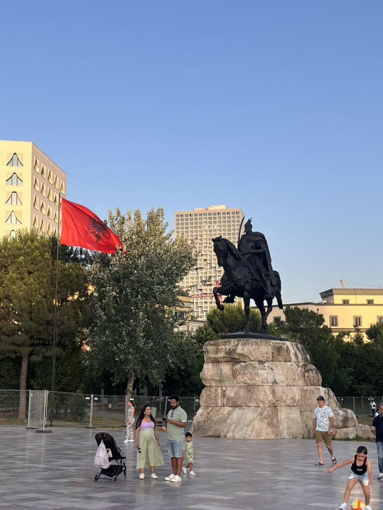

> Skanderbeg Square, Tirana, Albania.

As the Ottoman Empire weakened, Albania declared its independence on November 28, 1912.
The next two and a half decades were tumultuous, marked by the reign of two kings and occupation during both World Wars.
These events eventually set the stage for Albania to become a socialist (“Stalinist”) state under Enver Hoxha, the First Secretary of the Labour Party.
From 1944 until his death in 1985, Hoxha ruled Albania as a rigid, Stalinist one-party regime defined by forced collectivization, state-enforced atheism (making Albania the world’s first officially atheist country), and extreme international isolation.

Stalin’s death in 1953 and Khrushchev’s speech "On the Cult of Personality and Its Consequences" denouncing the Stalin's methods in 1956 alarmed Hoxha.[^1]
He viewed de‑Stalinization as a betrayal of Marxism‑Leninism.
By 1961, Albania formally split from the USSR, expelled all Soviet advisers, and joined with Chairman Mao’s China as fellow anti‑revisionists.
Through the 1960s and early ’70s, Albania received Chinese economic and military aid.

[^1]: In this speech, Nikita Khrushchev denounced Stalin's methods of creating a cult around his personality and condemned Stalin’s brutal purges, mass arrests, executions, and the creation of a personality cult that placed Stalin above the party and the people.
    Read the full speech [here](https://digitalarchive.wilsoncenter.org/document/khrushchevs-secret-speech-cult-personality-and-its-consequences-delivered-twentieth-party) and more background on [Wikipedia](https://en.wikipedia.org/wiki/On_the_Cult_of_Personality_and_Its_Consequences).

But as Mao’s successors began opening China to foreign investment and rapprochement with the West (notably Nixon’s visit in 1972), Hoxha denounced China as "revisionist" as well.
By 1978 all Chinese personnel were gone, and Albania embarked on its "self‑reliance" policy.
From then until his death in 1985, Hoxha presided over Europe's North Korea.

He persecuted religious institutions, banned almost all private enterprise, and enforced strict travel restrictions.
His regime executed or imprisoned thousands deemed opponents, and Albania became one of the most repressive states in Europe.
For more on this and other historical stories of Albania, one should read [Lea Ypi's "Free"](https://www.goodreads.com/book/show/58085227-free).

The list of "tortures" done during Enver Hoxha's regime are horrendous — FAIR WARNING.
"Strapping dynamite on the body", "burning of sexual organs with petrol", "putting inside the coffin alive", "crushing breasts with pliers", "cat with claws put inside underpants of women and then hit with a wood".
These are beyond hurtful.

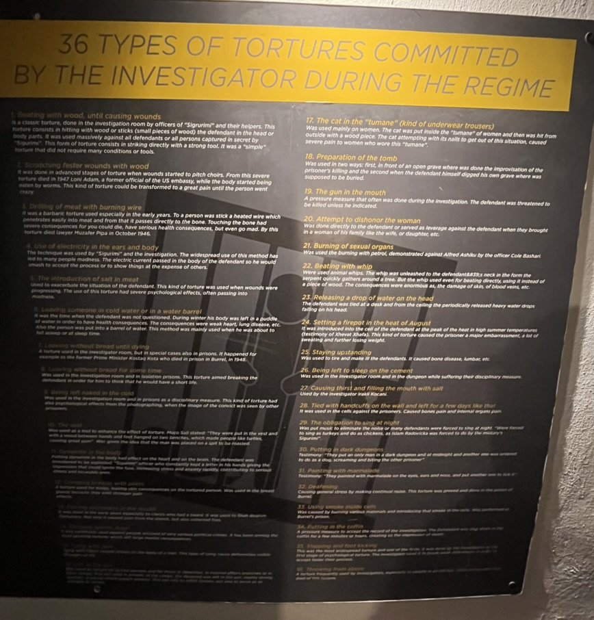

> 36 Types of Tortures Committed By The Investigator During The Regime.
> Courtesy: "[House of Leaves](https://www.wilsoncenter.org/blog-post/albanias-museum-secret-surveillance-house-leaves)" museum.

Upon Hoxha’s death in 1985, his successor Ramiz Alia cautiously introduced reforms under pressure from domestic unrest and Gorbachev’s Soviet policies.[^2]
By 1991 multi‑party elections had been held, and in March 1992 the center‑right Democratic Party assumed power, marking the end of the communist system.
The 1998 constitution enshrined rule of law and human rights.
Despite severe economic collapse and the 1997 crisis, Albania stabilized in the early 2000s, joined NATO in 2009, and is now an official candidate for European Union accession.

[^2]: See, US President Mr. Ronald Reagan's speech "[Mr. Gorbachev, Tear Down This Wall!](https://www.youtube.com/watch?v=IguMXrgfrg8)".

## How is Albania Today?

Today, Albania is a modern European nation, home to many beautiful attractions and stunning beaches.
I was fortunate to be hosted by my friend Dea Bardhosi, who, along with her sister Keti and their parents, generously showed me around the cities of Tirana and Durrës.
Here are some highlights from my trip.

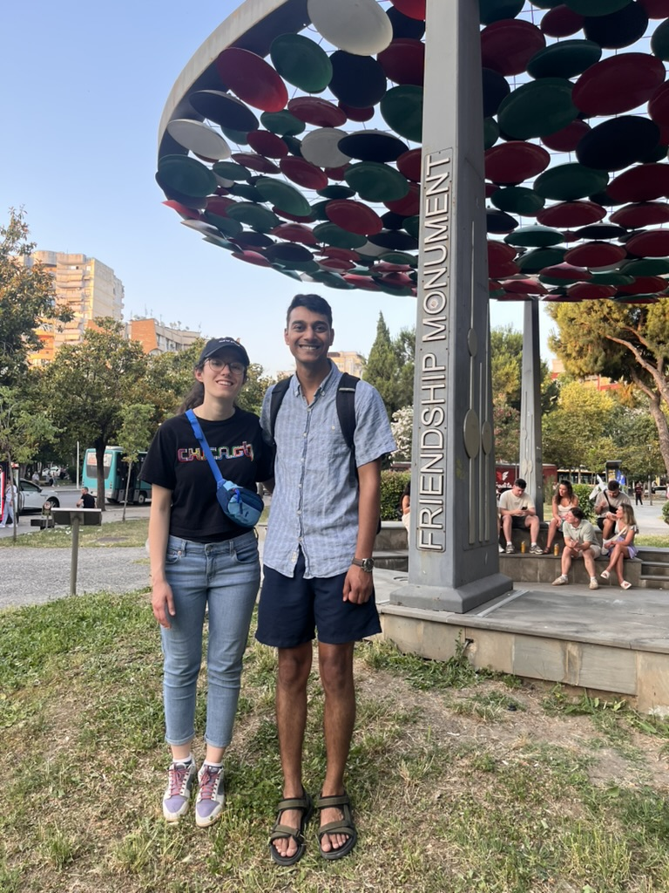

> Dea Bardhosi and I at the friendship monument in Tirana.

I landed at Tirana’s Nënë Tereza Airport (Mother Teresa Airport, TIA), which has direct connections to major European cities such as London, Paris, Munich, Frankfurt, and others, as well as flights to and from Dubai.
The airport is named after Mother Teresa, the renowned Catholic nun known for her service to India’s poor and sick.
Interestingly, although I always assumed she was Indian, she was actually Albanian by birth and became one of the first foreigners to acquire Indian citizenship through naturalization.
Despite her iconic status in Albania, Mother Teresa remains somewhat controversial in India, where she has been criticized for her practice of withholding anesthetics from patients, stemming from her belief that suffering brought one closer to God.

### Enver Hoxha Mausoleum "Pyramid"

One of Tirana’s most iconic landmarks is the **Pyramid of Tirana**.
Originally opened in 1988 as the Enver Hoxha Museum, it was designed to showcase the legacy of Albania’s communist dictator, Enver Hoxha.
Although sardonically referred to as the “Enver Hoxha Mausoleum,” it was likely never intended to house Hoxha’s remains.
Today, the Pyramid serves as a popular local attraction and event venue.

> The Pyramid of Tirana.

### Local Architecture in Tirana

Albania's Prime Minister since 2013, Edi Rama, is a former art professor and writer whose artistic sensibility is unmistakable throughout Tirana.
He's known for doodling on Microsoft Outlook printouts during ministerial meetings to help him concentrate—a detail that says a lot about his character.
After the fall of communism, when Rama became mayor of Tirana, his unconventional priority was to paint the city’s drab buildings in vibrant colors, even as basic infrastructure like street lights were failing.
At first, this struck many as an odd choice.
But over time, his policy began to work.
As Rama recalled in an interview with [The Guardian](https://www.theguardian.com/artanddesign/2016/nov/15/meet-edi-rama-albanias-artist-prime-minister-exhibition): "It had a chain effect I didn’t imagine. Once the buildings were coloured, people started to get rid of the heavy fences of their shops. In the painted roads, we had 100% tax collection from the people, while tax collection was normally 4%. People accepted to pay their share for the city, because they realised that through the colours the city exists."

His impact is evident everywhere: in Tirana, there’s hardly a building without character—a fact even I, with no artistic training, can’t help but notice.

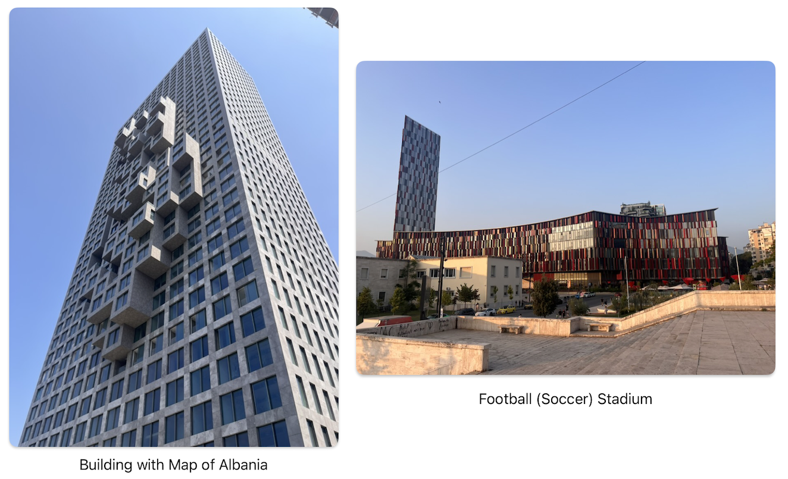

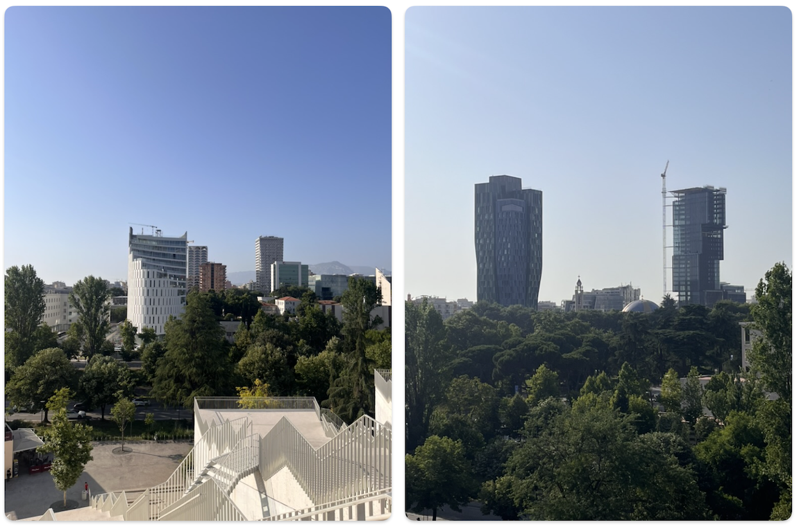

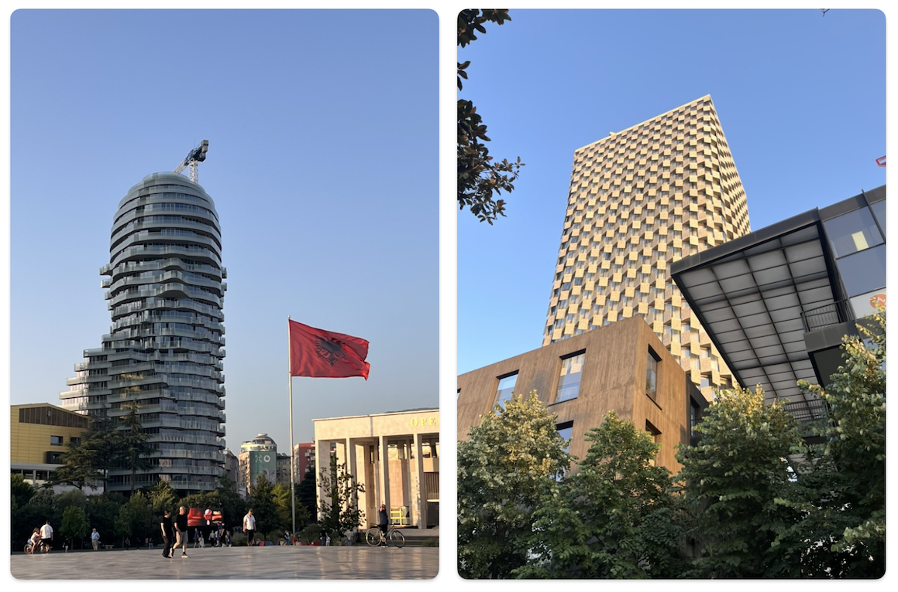

### Tirana's New Mosque

In 2024, the Namazgah (Grand) Mosque of Tirana was inaugurated by Turkish President Recep Tayyip Erdoğan.
The mosque was built almost entirely with funding from the Turkish government—about \$30 million, provided through ([Diyanet](https://en.wikipedia.org/wiki/Presidency_of_Religious_Affairs)).
Its location near the Albanian parliament underscores the growing acceptance of Islam in a country that was, until recently, officially atheist.
Today, it stands as the largest mosque in Albania, accommodating 8,000 people inside the main dome and an additional 2,000 in the courtyard.
The Islamic architecture is strikingly beautiful.

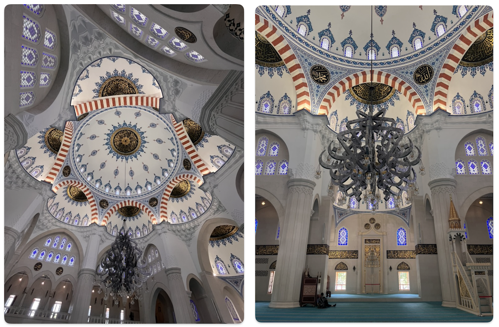

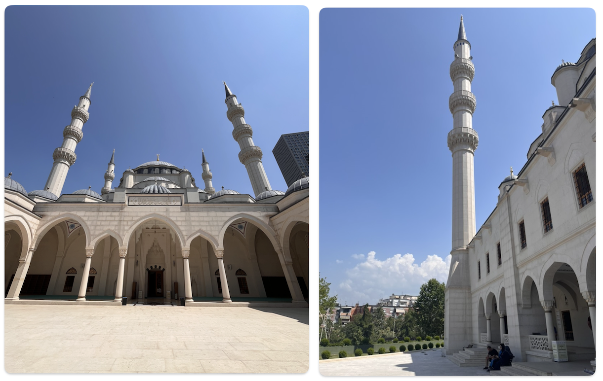

## Local Food in Tirana

I had the pleasure of sharing a traditional lunch with Dea’s family, and the local food was delicious.
We enjoyed goat shoulder, a platter of traditional Albanian dishes, and finished with flan accompanied by their classic espresso.
The meal was made even more memorable by the setting—at the top of the Dajti Mountains, which you can reach from Tirana by cable car (except on Tuesdays).

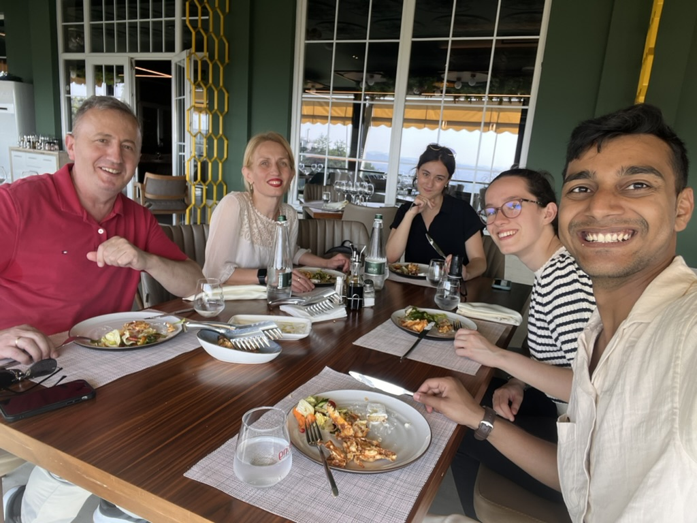

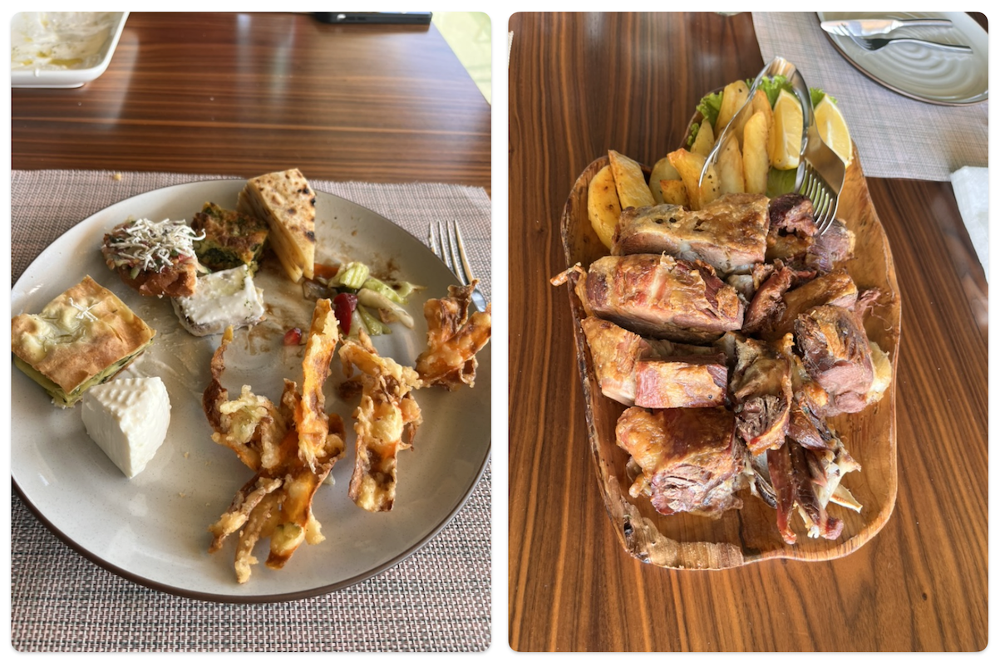

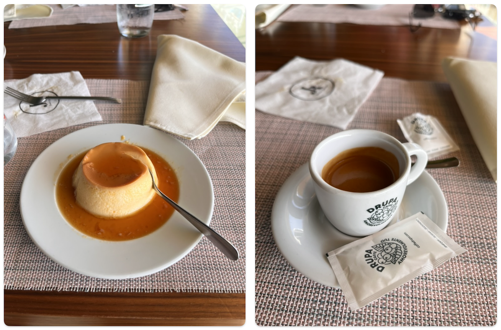

### Local Market

Tirana has local markets where one can shop for a variety of fresh fruits and vegetables.

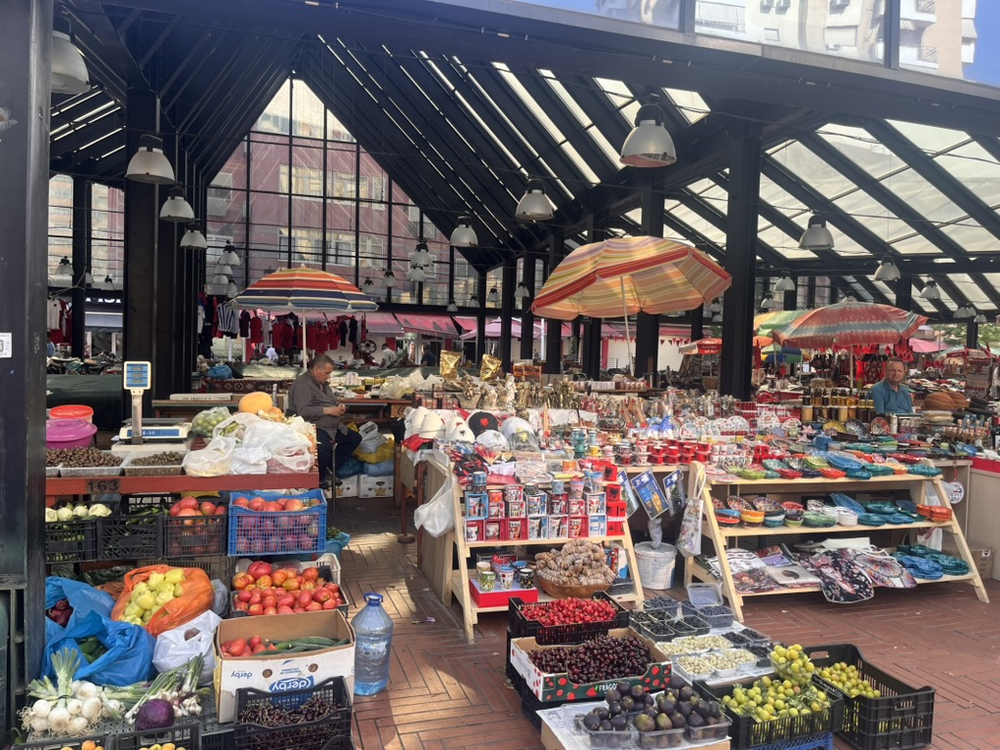

### Froyo: Frozen Yogurt

This was probably the first time I had frozen yogurt—and it’s likely one of the best I’ll ever have.
Albanians serve their froyo with a variety of fruit jams (strawberry, avocado, blueberry) and toppings like crushed almonds and shredded coconut.
It was so good that I had it again in Durrës.
I hope I get to try it again someday.

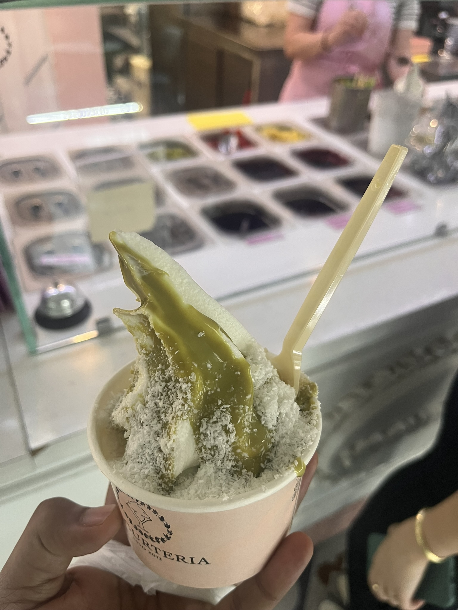

### Petulla: Albanian Fried Donuts

Petulla is a simple yet delicious Albanian version of donuts.
I definitely plan to try making them myself sometime.
They’re typically enjoyed with fruit jam and cheese.[^3]

[^3]: Recipe: <https://mediterraneanlatinloveaffair.com/albanian-fried-dough-petulla/>

## Beachtown: Durrës

Durrës is the second-most populous city in Albania, after Tirana.
It’s actually older than Tirana, having been a significant center during both the Greek and Roman eras.
The city is also home to an ancient Roman amphitheater, which—while smaller—bears some resemblance to the Colosseum in Rome.

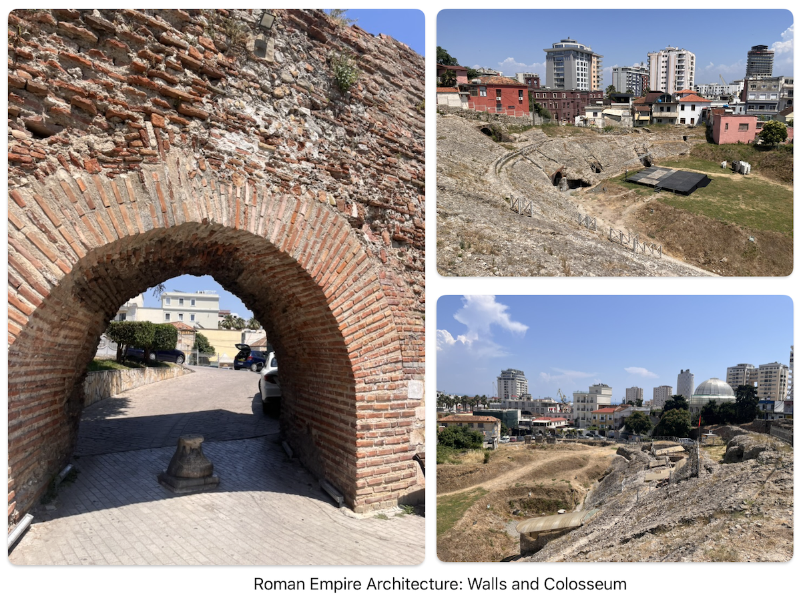

The beach at Durrës is very clean, though quite shallow; the water near the shore barely reached my shoulders, at about a meter deep.
The sea is clear and the waves are gentle, making it ideal for swimming.
I thoroughly enjoyed my time in the water with Dea.

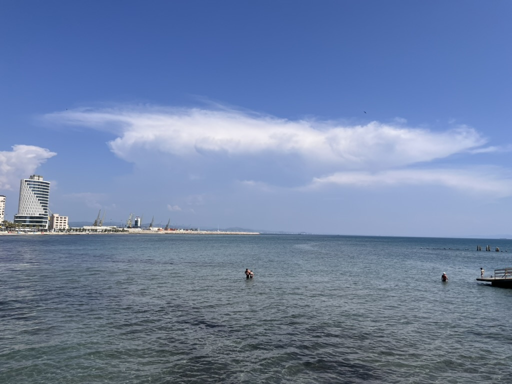

## Liquor to Try: Raki

Albanian raki (raki rrushi, or simply “raki”) is a strong fruit brandy that has been distilled in rural Albania for centuries.
The recipe varies by region: northern Albania typically produces grape-based raki (raki rrushi), while in central and southern areas, you’ll also find plum (slivovica), apricot (kajsie), and pear (dardhë) versions.

I picked up a bottle at the duty-free in TIA airport on my way back and have enjoyed it both as a shot and mixed into a cocktail with lychee, lemon, and sugar.

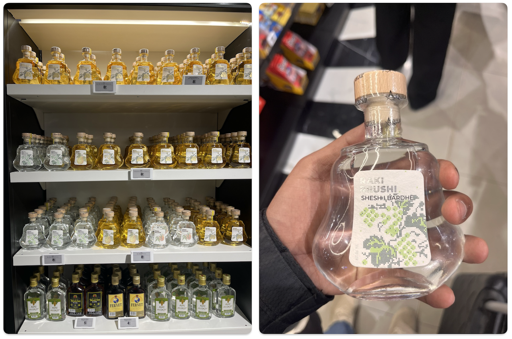

## Conclusion

My week in Albania gave me far more than a checklist of sights—it offered a window into a nation reshaping itself after decades of isolation and upheaval.
Tirana’s colorful streets, Durrës’ ancient ruins and gentle beaches, the warmth of Albanian hospitality, and the taste of local food and raki all left a vivid impression.
Albania is still carving out its place in Europe, balancing old wounds with new energy and optimism.

If you’re looking for a travel experience that’s both welcoming and thought-provoking, Albania is well worth a visit.
I’m grateful to Dea and her family for making me feel at home in a country still discovering itself—and I look forward to returning someday.
